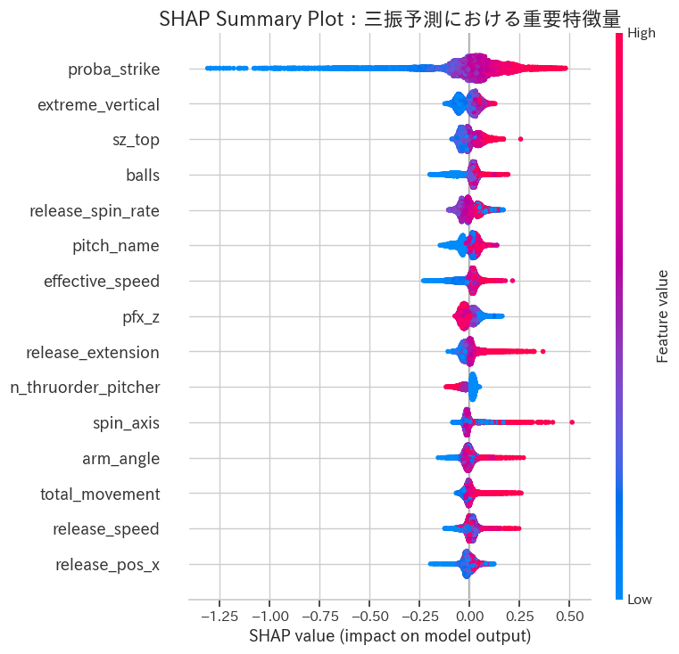
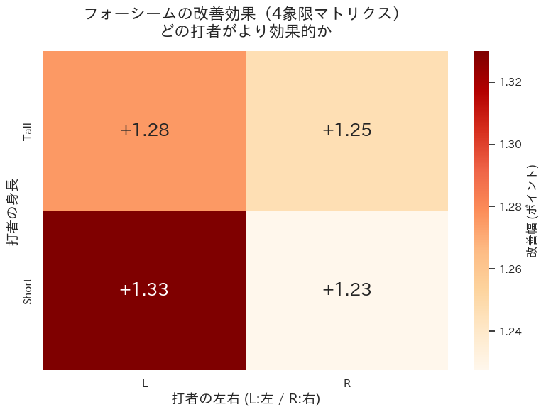

# portfolio
## ピッチデザイン最適化：MLBトラッキングデータを用いたストライク獲得の因果分析と戦術提案

### 1. プロジェクトの背景と目的

本プロジェクトは、MLB（メジャーリーグベースボール）の投球トラッキングデータを用いて、**「投手のストライク獲得確率を最大化するための具体的なフォーム指導・配球戦術（ピッチデザイン）」** を導き出すことを目的としています。

単なる機械学習による高精度な予測にとどまらず、「ドメイン知識に基づく特徴量エンジニアリング」「What-ifシミュレーション」「因果推論」を組み合わせることで、現場のコーチや選手が明日から実行可能な **「統計的根拠と高いROI（投資対効果）を伴うアクション」** を提案します。

**※注釈：本分析における「ストライク」の定義について**
元データには打者の詳細な結果（ファール単体など）が細分化されていなかったこと、および現場への戦術提案をシンプルにするため、本分析における「ストライク予測」は理論上 **「空振り ＋ 見逃し ＋ ファール」を含む広義のストライク獲得** として定義し、扱っています。

> **使用データ**: Kaggle "Predict strikeouts with new MLB arm angle data"
> 
> **主な技術**: Python, LightGBM, SHAP, Seaborn, Statsmodels (Logistic Regression), SciPy (t-test / Bonferroni Correction)

---

### 2. 分析のハイライト（Executive Summary）

本分析を通じ、現場の意思決定に活かせる以下のインサイトを得ました。

* **【ROIの比較】球速（フィジカル）よりホップ成分（技術）を磨く**

  交絡因子を統制した因果分析の結果、球速を1マイル上げてもストライク獲得オッズは約1.01倍に留まるの一方、ホップ成分（縦変化）を1単位増やすと約1.06倍になることが判明しました。

  数キロの球速アップという過酷なフィジカルトレーニングよりも、ボールの握りやリリース角度を調整する技術的アプローチの方がROIが高いことが示唆されます。

* **【効果の異質性（HTE）】対低身長の左打者が最も効果的**

  「ホップ成分+2.0インチ」の改善効果は一律ではありません。
打者を「高身長／低身長」と「左打者／右打者」の4象限に分けた結果、低身長 × 左打者に対して特に高い効果（+1.3ポイントのストライク率向上）が得られることを確認しました。

* **【リスクの排除】カーブ・スプリットへの指導は限定的効果**

  多重検定（ボンフェローニ補正）により、ホップ成分の向上はフォーシーム等の「速球系」でのみ一貫した改善効果が確認されました。一方で、カーブやスプリット等の縦変化球には効果が限定的で、戦術適用には注意が必要です。

---

### 3. 分析プロセス：課題の再定義

Kaggleコンペティションの本来の目的は「三振予測」でした。しかし、ベースラインモデル（S2モデル）のSHAP解析により、三振を奪う最大の要因は「ストライク確率」に帰結することが判明しました。

現場での指導において「三振を取るためにストライクを投げろ」と指示するのは非現実的です。重要なのは 「どうすればストライクが取れるか」 です。
そこで本プロジェクトでは、**機械学習の目的を「三振予測」から、より上流かつアクション可能な「ストライク予測（S1モデル）」にスコープを修正** しました。

> S1モデルのSHAP解析では、投手側の物理的要因として「pfx_z（ホップ成分）」、打者側の要因として「sz_top/bot（打者の体格）」がストライク獲得に強い影響を与えることが示されました。

---

### 4. 戦術のシミュレーションとターゲティング

SHAPによる探索で得られた仮説を検証するため、テストデータに対して **「フォーシームのホップ成分を一律で +2.0インチ 改善した場合」のWhat-ifシミュレーション** を実施しました。

さらに、打者のストライクゾーンの高さに基づき「高身長／低身長 × 左打者／右打者」の4象限マトリクスを作成し、誰に対して最も効果的かを評価しました。

> 結果: 全体平均よりも改善幅が大きい 低身長 × 左打者 に対して局所的に高い効果（+1.3pt）が確認され、現場での戦術ターゲティングが具体化されました。  

---

### 5. 統計的妥当性と因果関係の証明

#### 5.1 多重検定の補正

  10種類の球種に対して一斉に効果測定（t検定）を行ったため、偽陽性を防ぐためにボンフェローニ補正（有意水準 $\alpha = 0.05 / 10 = 0.005$）を適用しました。
これにより、フォーシーム・シンカー等の速球系でのみ効果を有意に確認でき、戦術適用の失敗リスクを最小化しました。  

#### 5.2 交絡因子の統制（ロジスティック回帰）

「ホップする球はストライクになりやすい」という結果が、「そもそも球速が速いからではないか？」という交絡を排除するため、以下のロジスティック回帰を構築しました。

| 特徴量 | 効果量（オッズ比） | 95% 信頼区間 | p値 | 有意性 |
| :--- | :--- | :--- | :--- | :--- |
| **pfx_z (ホップ成分)** | **1.063** | 1.053 - 1.073 | 5.72e-36 |有意|
| release_speed (球速) | 1.007 | 1.006 - 1.008 | 2.32e-33 |有意|
| release_extension (踏み込み幅) | 1.007 | 0.996 - 1.017 | 2.32e-01 |有意差なし|

「pfx_zが1単位増加するとストライク獲得オッズが1.06倍になる」という条件付き影響を統計的に有意に確認しました。

交絡因子を統制した結果、「pfx_zが1単位増加するとストライク獲得オッズが1.06倍になる」という条件付き影響を統計的に有意に確認しました。
小さなオッズ比変化に見えますが、これは確率換算で直感的に理解できる実質的なインパクトを持っています（例: 確率50%のストライク状況において、1.06倍のオッズ上昇は **約1.5%の確率増加** をもたらします）。

---

### 6. ディレクトリ構成

* `main_analysis.ipynb` : データ前処理、S1/S2モデリング、What-ifシミュレーション、効果検証（検定・ロジスティック回帰）を一本化したノートブック。
* `images/` : READMEで使用している出力グラフ。
* `README.md` : 本ドキュメント。
(※Kaggleの規約およびデータサイズを考慮し、生データ（csv）は本リポジトリには含めていません。)
